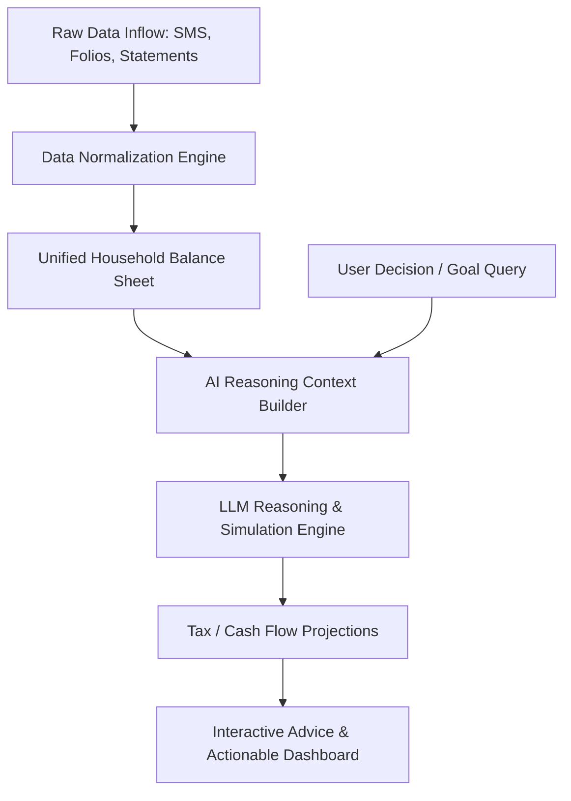

# System Design: AI Financial Operating System

ArthAI operates under the premise that financial planning in India is fundamentally collaborative, multi-generational, and multi-asset. 

Unlike Western apps focused heavily on 401(k) / Roth IRA and standard bank checking/savings, the Indian Middle Class balance sheet consists of highly complex, illiquid, and emotional assets:
- **Physical Gold:** Often ancestral, occasionally leveraged for Gold Loans.
- **Real Estate:** Often the single largest asset, heavily funded by high-EMI Home Loans.
- **Fixed Deposits (FDs):** Regarded as the "safe haven", but highly tax-inefficient.
- **EPF & PPF:** Compulsory and voluntary debt instruments with distinct lock-in and tax terms.
- **Mutual Funds:** The modern wealth creation engine, yet subject to market volatility and behavior.
- **LIC / Traditional Insurance:** Bundled insurance-investment plans that are low-yield but deeply trusted.

---

## The AI Financial Reasoning Loop

The core component of ArthAI is the **Reasoning Loop**, which uses Large Language Models to simulate and validate financial paths:

### Components

1. **Unified Household Balance Sheet:** Maps multiple individual profiles under a single household ID, allowing joint tracking and multi-generational tax optimization.
2. **Context Builder:** Pulls the current assets, liabilities, goals, and tax regime (Old vs. New) to feed into the reasoning prompt.
3. **Reasoning & Simulation Engine:** Translates raw unstructured queries (e.g. *"Can we buy a car for 12 Lakhs using our FD, and what does it do to our kids' education plan?"*) into a parameterized simulation, running projections over tax rates, loan EMIs, and equity returns, before feeding the raw data back to the LLM to write a friendly, narrative analysis.
4. **Structured JSON Output:** The reasoning model outputs both text recommendations and a structured JSON payload used to render custom charts (e.g., Cashflow Sankey diagram or Goal-Affordability Timeline).
