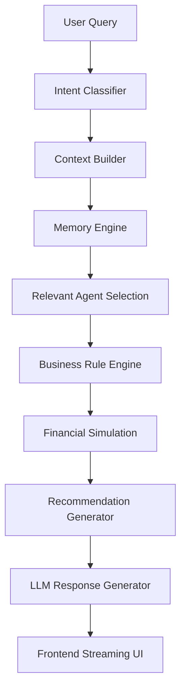

# ArthAI Intelligence Layer Architecture

This document describes the design and flow of the **ArthAI Intelligence Layer**, which implements a strict separation of deterministic reasoning, context assembly, multi-agent evaluation, business calculations, and conversational natural language generation.

---

## Architecture Overview

ArthAI is not a simple wrapper or chatbot. It is a multi-agent financial reasoning operating system structured around a 9-step execution pipeline:

---

## Core Components

### 1. Central AI Orchestrator (`ReasoningOrchestrator`)
Located in `backend/app/engine/reasoning.py`.
- Entry point for all user requests.
- Coordinates data retrieval, intent classification, memory extraction, specialist execution, rule calculations, and final OpenAI response generation.
- Implements asynchronous streaming capability for real-time frontend printing.

### 2. Intent Classifier (`IntentClassifier`)
Located in `backend/app/engine/intent_classifier.py`.
- Classifies user queries across 14 supported intents: General Financial Advice, Expense Analysis, Cash Flow, Goal Planning, Investment Advice, Insurance Analysis, Decision Analysis, Scenario Simulation, Document Analysis, Subscription Review, Financial Health, Tax Planning, Retirement Planning, and Emergency Fund.
- Supports multi-intent routing for queries matching multiple domains (e.g. buying a car and its impact on your daughter's education goal).

### 3. Context Builder (`ContextBuilder`)
Located in `backend/app/engine/context_builder.py`.
- Gathers all active database values associated with the user profile, investments, goals, insurance, assets, and liabilities.
- Formulates a unified, read-only Python payload. The LLM never queries the database directly.

### 4. Memory Engine (`MemoryEngine`)
Located in `backend/app/engine/memory_engine.py`.
- Handles both Short-Term (recent chat context) and Long-Term (preferences, risk tolerance, past decisions) memories stored in Supabase.
- Automatically generates summaries, categorizes memory types, and assigns importance scores (1-10) at the end of each conversation turn.

### 5. Specialized AI Agents
Located in `backend/app/agents/specialists.py`.
- Independent agents responsible for analyzing specific sections of the context:
  * **Profile Agent**: Household demographics, risk appetite.
  * **Cash Flow Agent**: Savings ratios, burn rates, cash flow trends.
  * **Goal Agent**: Projecting completion horizons and tracking underfunded goals.
  * **Investment Agent**: Asset allocation, returns analysis, and diversification scores.
  * **Insurance Agent**: Coverage gap analysis.
  * **Decision Agent**: Evaluating major purchase affordability, computing impact metrics.
  * **Scenario Simulator Agent**: Feeds arguments into standard calculations and maps results.
  * **Insight Agent**: Identifies anomalies or saving opportunities.
  * **Recommendation Agent**: Ranks actions based on urgency and prioritizes next steps.

### 6. Business Rule Engine (`BusinessRuleEngine`)
Located in `backend/app/engine/rules_engine.py`.
- Implements purely deterministic mathematical financial metrics. No LLM hallucinations are allowed inside financial calculations.
- Metrics include DTI, Savings Rate, Net Worth, Emergency Runway (months), Goal Completion, and overall Financial Health Score (0-100).

### 7. Scenario Simulation Engine (`SimulationEngine`)
Located in `backend/app/engine/simulation_engine.py`.
- Runs predictive models for key life events:
  * *Career Switch / Salary changes*
  * *Vehicle / Home purchases*
  * *Medical emergencies / Vacations*
- Returns structured impact assessments: Current vs. Future Position, Cash Flow Difference, Goal Delays, Net Worth Difference, Risk Level, Recommendation, Confidence.

### 8. OpenAI Service (`OpenAIService`)
Located in `backend/app/engine/openai_service.py`.
- Implements strict system prompts instructing the LLM to function as a strict, non-conversational CFO.
- Takes structured payloads containing context, business rule metrics, simulation outcomes, and memories to compile real-time, explainable, practical advice.
